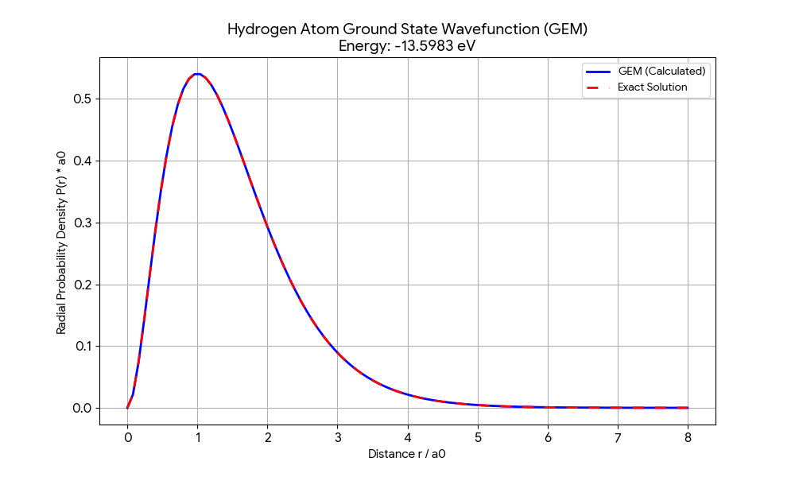

# Numerical Solution of Hydrogen Atom in C++

This repository contains C++ implementations for solving the Schrödinger equation of the Hydrogen atom using two different numerical methods:

1.  **Gaussian Expansion Method (GEM)** - A variational method using Gaussian basis functions.
2.  **Numerov Method** - A finite difference method for solving 2nd order differential equations.

## 1. Gaussian Expansion Method (GEM)

GEM solves the generalized eigenvalue problem:
$$ (K + V)\mathbf{c} = E N \mathbf{c} $$

* **Basis:** Geometric progression of Gaussian functions.
* **Library:** [Eigen3](https://eigen.tuxfamily.org/) for matrix operations.
* **Features:**
    * Calculates the ground state energy of the Hydrogen atom.
    * Outputs the wavefunction and exact solution for comparison.

### Results (GEM)
The calculated ground state energy matches the theoretical value (-13.6 eV) with high precision.



## 2. Numerov Method

Solves the radial Schrödinger equation by discretizing the coordinate space.
*(Numerovの説明をここに書く)*

## Requirements

* g++ (C++ Compiler)
* Eigen3 (Linear algebra library)

## Usage

### Compile and Run GEM
```bash
cd GEM
g++ -I /usr/include/eigen3 src/main.cpp -o gem
./gem
```

### Plotting
```bash
python3 plot_gem.py
```

## Author
[Your Name]
